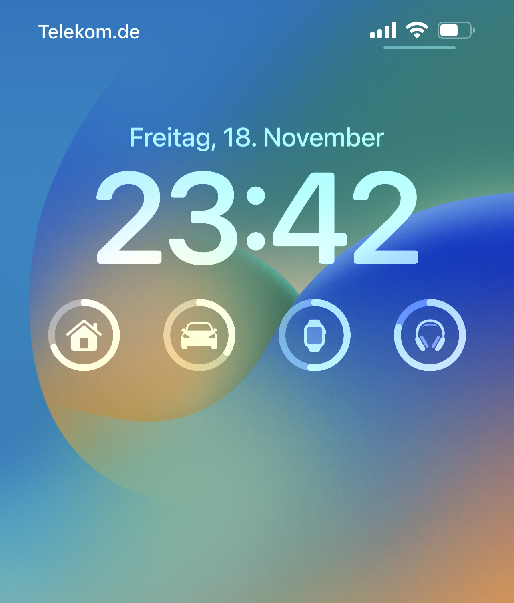

# Home battery widget for iOS 16

An iOS 16 lockscreen widget to display home batteries with [Scriptable](https://scriptable.app/).

## How does it work (for me)?
This implementation is powered by a home battery MyReserve Matrix from Solarwatt that is connected to a local kiwigrid installation.

Battery information is regularly read with [kiwi](https://github.com/awaescher/kiwi), pushed to [kvstore.io](https://kvstore.io) with [kiwipush](https://github.com/awaescher/kiwipush).

The javascript code in this repository can be used to build a widget with the free [Scriptable](https://scriptable.app/) app. It retrieves the values from [kvstore.io](https://kvstore.io) that were pushed before and uses them to build the gauge widget.

--- 

The following screenshot shows this widget besides other battery widgets on iOS:

1. Home battery widget (this repository)
2. TESLA battery widget
3. Apple battery widget
4. Apple battery widget

